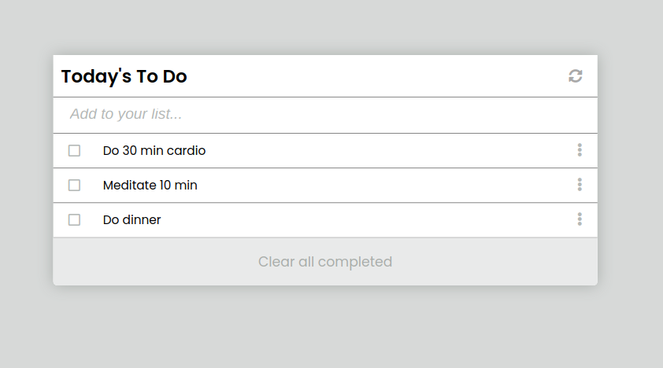

# To-Do List

> A ToDo list built using webpack.

In this project it's asked to build a to do list, where we can add, mark as complete, remove and clear tasks. The goal is to use Webpack to compile the app.

## Built With

- JavaScript
- Webpack

## Getting Started

To get a local copy up and running follow these simple example steps.

### Setup

- Clone the repo `git clone git@github.com:Leandro-Barretoo/ToDo_Redo.git`
- `cd` into the directory
- checkout to the list_structure branch `git chechout list_structure`
- open in your desired code editor

## Authors

👤 **Leandro Barreto**

- GitHub: [@Leandro-Barretoo](https://github.com/Leandro-Barretoo)
- LinkedIn: [Leandro Barreto](https://www.linkedin.com/in/leandroobarreto/)

## 🤝 Contributing

Contributions, issues, and feature requests are welcome!

Feel free to check the [issues page](../../issues/).

## Show your support

Give a ⭐️ if you like this project!

## Acknowledgments

- Hat tip to anyone whose code was used
- Inspiration
- etc

## 📝 License

This project is [MIT](./MIT.md) licensed.
